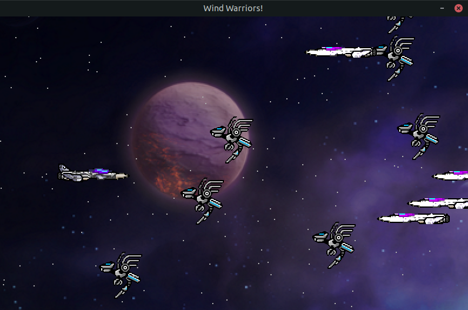
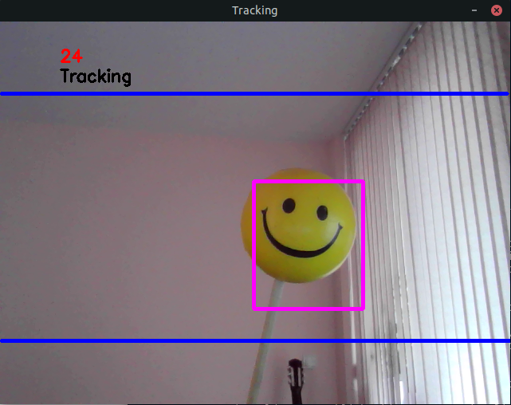

# Wind-Warriors-Computer vision game

A game using computer vision created with OpenCV and Pygame

## Introduction
This game was created for learning and experiencing the OpenCV technology 
alongside the with learning the Pygame library.

## Technologies
- Python 3.8.10
- Pygame 1.9.6
- OpenCV 4.2.0

## Setup

```
$ sudo apt install python3.8
$ python3.8
```
```
$ sudo apt install python3-pygame
```
```
$ pip install opencv-contrib-python
```

## Screenshot



